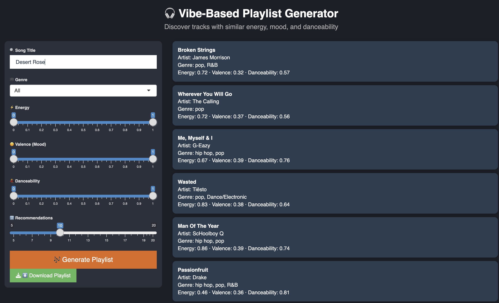
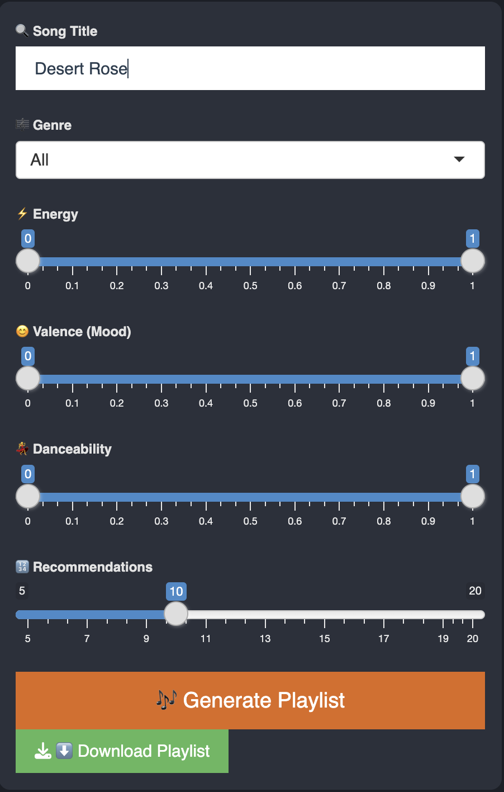

```{r, include = FALSE}
knitr::opts_chunk$set(
  collapse = TRUE,
  comment = "#>"
)
```

```{r setup}
library(music)
library(dplyr)
# For vignette speed, limit to 100 songs
songs <- head(songs, 100)
```

## Introduction

The music R package powers a Shiny app that generates playlists based on "vibe" — using audio features such as energy, valence, and danceability.

Instead of relying on external APIs (e.g., Spotify), the app uses a local dataset of audio features like danceability, energy, valence, and tempo to compute vibe similarity between songs.

The app helps users discover songs that feel like the ones they already love.

## Launching the App

You can launch the full Shiny app with:

```{r, eval = FALSE}
launch_app()
```

This opens an interactive interface where users can:

```         
Search for a song by title

Adjust sliders for energy, mood, and danceability

Filter by genre

View a playlist of similar songs

Download the playlist
```

### App interface Example

Below is a screenshot of the Shiny app interface:

```{r screenshot1, echo=FALSE, out.width="100%"}

```

### Interactive Filters

And a closer look at the interactive interface, where users can type in the initial song, they can filter by genre and decide the energy, valence, and danceability values.

To refine results, the app includes:

Sliders for:

```         
energy

valence (happy/sad mood)

danceability
```

A genre filter dropdown

Control for number of recommendations

These allow the user to shape the "vibe zone" of the playlist.

```{r screenshot2, echo=FALSE, out.width="100%"}

```

## Dataset

The app uses a dataset of 2,000 songs containing the following columns:

```         
song: Song title

artist: Performing artist

genre: Song genre

others: danceability, energy, valence, acousticness, instrumentalness, liveness, speechiness, tempo: numerical audio features
```

Each row represents a single track.

To preview the data:

```{r}
head(songs)
```

## Core Idea: Similarity + Filtering

### Filtering by vibe

```{r}
filtered <- filter_songs_by_vibe(
  data = songs,
  energy_range = c(0.6, 1),
  valence_range = c(0.5, 1),
  dance_range = c(0.5, 1),
  genre = "Pop"
)
head(filtered)

```

Using the following function:

```{r}
filter_songs_by_vibe <- function(data, energy_range, valence_range, dance_range, genre = "All") {
  filtered <- data %>%
    dplyr::filter(
      energy >= energy_range[1], energy <= energy_range[2],
      valence >= valence_range[1], valence <= valence_range[2],
      danceability >= dance_range[1], danceability <= dance_range[2]
    )

  if (genre != "All") {
    filtered <- filtered %>% dplyr::filter(genre == genre)
  }

  return(filtered)
}
```

### Calculating Euclidian Similarity

The app calculates the Euclidean distance between the feature vector of the input song and all other songs in the dataset.

Given a song S, we extract its audio feature vector and we filter:

```{r}

features <- c("danceability", "energy", "valence", "acousticness", 
              "instrumentalness", "liveness", "speechiness", "tempo")

query_song <- "Stay"
song_vec <- songs[songs$song == query_song, features] |> as.numeric()

filtered$distance <- compute_vibe_distance(song_vec, filtered, features)

filtered %>%
  filter(song != query_song) %>%
  arrange(distance) %>%
  select(song, artist) %>%
  head()

```

Given the computed distance:

```{r}

compute_vibe_distance <- function(song_vector, candidates, feature_cols) {
  apply(candidates[, feature_cols], 1, function(x) {
    sqrt(sum((as.numeric(x) - song_vector)^2))
  })
}

```

The 10 songs with the smallest distance (excluding the original) are returned as recommendations.

## Example

Suppose a user searches for "Stay", sets the energy range to [0.6, 1.0], danceability to [0.5, 1.0], genre Pop.

### Step-by-step process:

```         
    Match "Stay" in the dataset

    Filter the dataset to include only songs that match the     user's slider and genre filters

    Compute Euclidean distances between "Stay" and the          filtered songs

    Return the top N closest songs
```

### R code example:

```{r}
library(dplyr)
library(music)

# Define features
features <- c("danceability", "energy", "valence", "acousticness", 
              "instrumentalness", "liveness", "speechiness", "tempo")

# Filter by vibe and genre
filtered <- filter_songs_by_vibe(
  data = songs,
  energy_range = c(0.6, 1.0),
  valence_range = c(0, 1),         # Leave valence open for now
  dance_range = c(0.5, 1.0),
  genre = "Pop"
)

# Find song vector for "Stay"
song_vec <- filtered %>%
  filter(tolower(song) == "stay") %>%
  select(all_of(features)) %>%
  as.numeric()

# Compute vibe distances
filtered$distance <- compute_vibe_distance(song_vec, filtered, features)

# Show top 5 most similar songs
filtered %>%
  filter(song != "Stay") %>%
  arrange(distance) %>%
  select(song, artist, genre) %>%
  head(5)

```

### Output

This returns a playlist of songs that feel similar to "Stay" in mood, energy, and rhythm — based on filtered and ranked Euclidean distance.

You can then download this playlist from the app or explore more by adjusting sliders.
